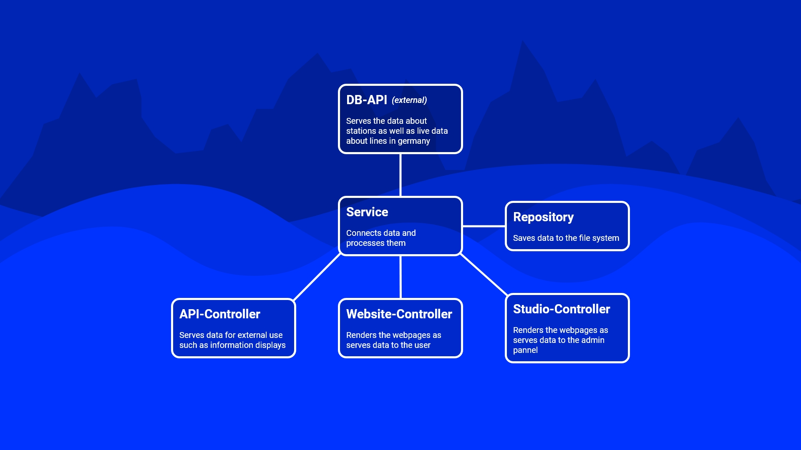

## The Problem

Traveling by public transport like bus and train is a mess in Germany. Trains are delayed very often or are cancelled. You are using a platform other than the one indicated in the timetable and it is difficult to use them barrier-free. However, the above things must work for train connections. Germany does not have many big cities but a lot of small ones and has therefore a large but closely interconnected network. The possibility of having many train transfers is much higher than in other neighboring countries such as France with fewer cities but bigger ones. The closely interconnected network requires working train transfers but also boosts train delays and cancellations because of the complexity and often bad capacity. Missed transfers can increase the travel time extremely.

The German main train company "Deutsche Bahn" is operated privately but owned by the German government. It is very unreliable due to a huge lack of money for urgently needed investments. It gets better over the years because more people travel by train which generates more income but it is far from perfect.

Another difficulty can occur before the trip. Which ticket should I buy and what type of transportation can be used with which ticket? Every transportation company as well as cities and transport associations have their own ticket system with different validities and conditions. It is possible to learn the ticket system of your region but can get easily lost in others. What makes it more difficult is the software of ticket machines. These are often very confusing and incomprehensible as well as different in every region.

But it is actually nice to travel by train. A car can get very expensive, there are traffic jams and many highway construction sites. German highways do often not have speed limitations but are often slow because of the things mentioned earlier. You must also have good concentration on long trips and can't do something else like reading a book or playing a game. The carbon footprint is furthermore much smaller on the train than on the plane or car.

## A Possible User-Centric Solution

The main goal of the Passenger Information System is to solve these two problems of reliability and complexity to make public transport better than cars and planes just by giving the user more information about the journey.

### Delay Prediction

Delays do not occur randomly but are a result of poor planning and insufficient capacity. That also means that delays do affect the same lines while others are more on time. Delays are also different depending on the time of the day as well as vacation seasons.

It would help the user to tell if the train has often a delay on this specific route at this specific time. Such information can help to plan the train transfers. If a train train has a high possibility of being late, the user can choose an alternative. Thankfully the German closely interconnected network makes it possible to choose another path because there are often so many ways to the target destination.

"Viele Wege führen nach Rom!" (Many paths lead to Rome) - a german phrase

(Delay prediction UI concept coming soon)

### Ticket Guide

Tickets depend on the individual needs of passengers. Do they travel alone? With a partner or a family? Do they use public transport in combination with a car or bike? In which region? Long distance or regional? Often or sometimes? Cheap or fast and noble? Do they have a bonus membership? These are just some of the questions to ask. The idea is to collect information about tickets and present the user the ticket that he needs with the same system third-party ticket-selling process across all regions.

(Ticket guide UI concept coming soon)

## How To Achieve This

Data is requested from the DB-API by the services. The services are also responsible for the the data processing. The repository saves the data to the file system. It does not store the data on a database, because that is more complicated and I am operating on a limited time frame. The controller, which are obtaining the data from the services exposes the data as API or as web page for user access. Every entity type has its own repository, service, controller stack.

### Difficulties of Development

The Deutsche Bahn (DB) has an API that serves data for stations, line schedules and live data. It is called "DB API Marketplace" and can be found at [https://developers.deutschebahn.com/db-api-marketplace/apis/frontpage](https://developers.deutschebahn.com/db-api-marketplace/apis/frontpage). But this marketplace has unfortunately many problems. Some APIs are very poorly designed and use different formats. Some are returning the data as XML others in JSON. The documentation is often not present or minimalistic and some variable names have only a single character which makes it hard to tell what purpose it has. Moreover, entities have different IDs depending on which API they are to make it nearly impossible to use them together even though it is necessary to retrieve all required information. Delays of trains are deleted after less than an hour to disguise how bad the DB is which requires constant requests to collect delay information but plans for higher rate limits are extremely expensive. The RIS::Stations API for example, which is used to collect station data, starts with the XS plan for 50.00 Euro a year and ends with the XL plan for 90.000 Euro a year but only increases the rate limit per month and not per second. The only way would be to use a lot of free accounts and bomb the DB-APIs with requests.

Some information can not be found in the DB-API because the DB thinks that they are information about critical infrastructure. The wheelchair user seems to be so dangerous that data about platform heights for barrier-free boarding cannot be obtained from the DB. But even worse is that the DB often itself does not know what platforms they have because it is not digitized properly. They have a paper manual on every station that has this information, these manuals also contain information about track and signal infrastructure.

Railway employees seem to love exceptions because they have one for every single possibility. Train splits or line number changes in the middle of the line or just the easiest ones to implement. A train can arrive at one platform and depart from another. Some lines change based on seasons, days of the week, holidays, or because of construction sides. Sometimes you have different timetables and you have to distinguish which is the actual one. This happens with replacement timetables, but they can also be incorrect because they do have not enough drivers to stick to the schedule so the drivers do just something else. How should a user understand this complex mess if even the service of the DB can not tell me what is going on? The most commonly used excuse is that the affected operator is a subsidiary company and that they do not know what they are doing and how to contact them.

### Roadmap

### Concepts

(UI concepts coming soon)